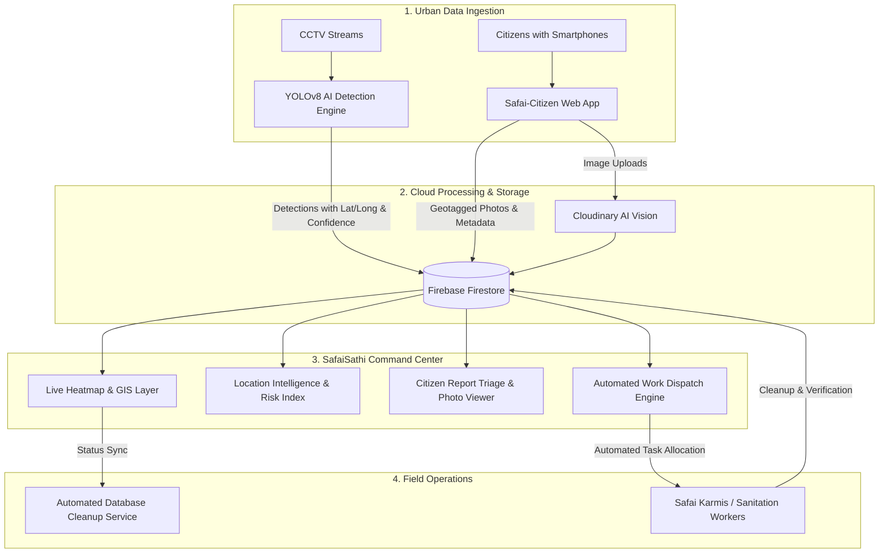

# 🌿 SafaiSathi — Municipal Waste Intelligence Dashboard

> **The Smart Waste Guardian For Urban Spaces**  
> *Transforming Cities. Empowering Communities.*

[](https://nextjs.org/)
[](https://www.typescriptlang.org/)
[](https://tailwindcss.com/)
[](https://firebase.google.com/)
[](https://leafletjs.com/)

SafaiSathi is an integrated municipal waste intelligence and workforce management platform designed for city administrations, sanitation departments, and urban local bodies. By turning existing CCTV infrastructure into smart urban sensors and crowdsourcing real-time citizen reports, SafaiSathi shifts urban sanitation from **reactive complaint-handling** to **proactive, automated management**.

---

## 🌐 Connected Ecosystem & Repositories

SafaiSathi operates as an integrated triad of technologies:

| Component | Description | Repository / Link |
|---|---|---|
| **🤖 AI Detection Model** | Computer vision model (YOLOv8) trained for real-time garbage, littering, and overflowing bin detection on CCTV surveillance feeds. | [Safai-Saathi-Model](https://github.com/aniket123de/Safai-Saathi-Model) |
| **📱 Citizen Portal** | Mobile-first citizen reporting web app with camera capture, geolocation tagging, and gamified civic rewards. | [Safai_Citizen Repo](https://github.com/bepoooe/Safai_Citizen) <br> [Live App](https://safai-citizen.vercel.app/) |
| **🖥️ Municipal Dashboard** | Central operational command center for analytics, live GIS heatmaps, Safai Karmi work assignment, and report generation *(This Repository)*. | [SafaiSathi Dashboard](#) |

---

## 🏗️ System Architecture & Workflow



---

## ✨ Key Features

### 1. 🛰️ Live GIS Heatmap & Hotspot Visualization
- Real-time intensity heatmaps plotted over municipal wards using Leaflet.
- Support for **Terrain**, **Satellite**, and **Hybrid (with street labels)** views.
- Color-coded geodesic boundary clusters and risk levels.
- Built-in **Automated Database Cleanup Engine** that prunes resolved points every 30 seconds.

### 2. 📍 Location Intelligence & Analytics
- Area-wise garbage overflow analysis with primary GPS coordinate mapping.
- Detection accuracy ranges, risk level classifications, and confidence trends.
- Paginated detection event logs with timestamps and confidence scores.

### 3. 👷 Workforce (Safai Karmi) Management
- Full lifecycle management of municipal sanitation staff.
- **Automated Work Allocation Algorithm:** Matches open high-risk overflow zones with active workers in the corresponding ward.
- Field metrics: Total collections, worker star ratings, assigned/pending work, and contact details.
- Comprehensive CRUD and edit modals.

### 4. 👥 Citizen Report Triage & Evidence Viewer
- Real-time intake of reports submitted via the [Safai-Citizen portal](https://safai-citizen.vercel.app/).
- **Embedded Photo Inspection:** High-resolution image preview with full-size lightbox viewer.
- AI analysis results breakdown (confidence scores, detected classes, and severity).
- Status resolution pipeline (`pending` ➔ `in_progress` ➔ `resolved`).

### 5. 📄 Official PDF Compliance Reports
- One-click client-side export of comprehensive municipal waste intelligence reports formatted with Indian Standard Time (IST) timestamps.

---

## 🛠️ Technology Stack

- **Framework:** [Next.js 15](https://nextjs.org/) (App Router, Server & Client Components)
- **Language:** [TypeScript](https://www.typescriptlang.org/)
- **Styling:** [Tailwind CSS v4](https://tailwindcss.com/) with custom warm terracotta & parchment theme
- **Authentication & Database:** [Firebase Authentication](https://firebase.google.com/docs/auth) & [Cloud Firestore](https://firebase.google.com/docs/firestore)
- **Maps & Geospatial:** [Leaflet](https://leafletjs.com/), [React-Leaflet](https://react-leaflet.js.org/), [Leaflet.heat](https://github.com/Leaflet/Leaflet.heat)
- **Icons:** [Lucide React](https://lucide.dev/)
- **Document Generation:** [html2pdf.js](https://github.com/eKoopmans/html2pdf.js)

---

## 📁 Project Structure

```text
safai-dash/
├── public/                     # Static assets and icons
├── src/
│   ├── app/
│   │   ├── dashboard/
│   │   │   ├── citizens/       # Citizen report triage & photo review
│   │   │   ├── heatmap/        # Live GIS Leaflet map & hotspot view
│   │   │   ├── staff/          # Safai Karmi workforce operations
│   │   │   ├── layout.tsx      # Dashboard layout wrapper
│   │   │   └── page.tsx        # Main analytics overview dashboard
│   │   ├── login/              # Admin authentication login
│   │   ├── signup/             # Operator onboarding
│   │   ├── globals.css         # Tailwind v4 imports & theme tokens
│   │   ├── layout.tsx          # Root application layout
│   │   └── page.tsx            # Public landing page
│   ├── components/
│   │   ├── DashboardLayout.tsx # Authenticated shell with sidebar & header
│   │   ├── Header.tsx          # Sticky top bar with quick actions & user status
│   │   ├── HeatmapLayer.tsx    # Leaflet canvas heatmap renderer
│   │   ├── GeodesicAreasLayer.tsx # Area boundary overlays
│   │   ├── LocationIntelligence.tsx # Ward-level intelligence module
│   │   ├── SafaiKarmiModal.tsx # Worker add/edit/view modal
│   │   └── Sidebar.tsx         # Collapsible operations navigation
│   ├── contexts/
│   │   └── AuthContext.tsx     # Firebase authentication context & session guard
│   ├── services/
│   │   ├── automatedCleanupService.ts # Database pruning & resolution sync
│   │   └── firebaseService.ts  # Firestore collections CRUD & aggregation
│   └── types/                  # TypeScript interfaces (Citizen, Karmi, Analytics)
├── .env.local.example          # Environment variables template
├── package.json
├── tsconfig.json
└── README.md
```

---

## 🚀 Getting Started

### Prerequisites
- [Node.js](https://nodejs.org/) (version 18.x or later recommended)
- [npm](https://www.npmjs.com/) or [yarn](https://yarnpkg.com/) / [pnpm](https://pnpm.io/)
- A [Firebase Project](https://console.firebase.google.com/) with Firestore & Authentication enabled.

### Installation

1. **Clone the repository:**
   ```bash
   git clone https://github.com/your-username/safai-dash.git
   cd safai-dash
   ```

2. **Install dependencies:**
   ```bash
   npm install
   ```

3. **Configure Environment Variables:**
   Create a `.env.local` file in the root directory:
   ```env
   NEXT_PUBLIC_FIREBASE_API_KEY=your_api_key
   NEXT_PUBLIC_FIREBASE_AUTH_DOMAIN=your_project.firebaseapp.com
   NEXT_PUBLIC_FIREBASE_PROJECT_ID=your_project_id
   NEXT_PUBLIC_FIREBASE_STORAGE_BUCKET=your_project.appspot.com
   NEXT_PUBLIC_FIREBASE_MESSAGING_SENDER_ID=your_sender_id
   NEXT_PUBLIC_FIREBASE_APP_ID=your_app_id
   ```

4. **Run the Development Server:**
   ```bash
   npm run dev
   ```
   Open [http://localhost:3000](http://localhost:3000) in your browser.

5. **Build for Production:**
   ```bash
   npm run build
   npm run start
   ```

---

## 🤝 Ecosystem Reference Links

- **Garbage Detection AI Model:** [aniket123de/Safai-Saathi-Model](https://github.com/aniket123de/Safai-Saathi-Model)
- **Citizen Web Application Repository:** [bepoooe/Safai_Citizen](https://github.com/bepoooe/Safai_Citizen)
- **Deployed Citizen Web Application:** [safai-citizen.vercel.app](https://safai-citizen.vercel.app/)

---

## 📄 License

This project is licensed under the MIT License. Developed for intelligent civic infrastructure and clean urban spaces.
